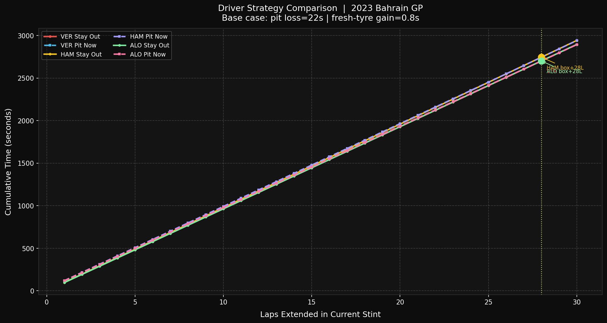
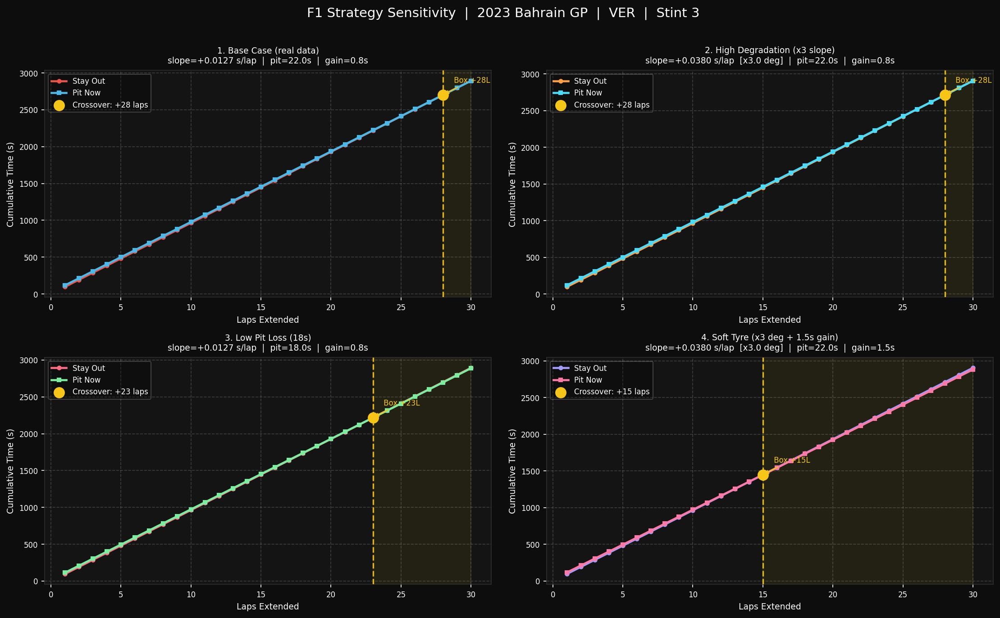

# F1-Race-Strategy-Simulator
Data driven F1 race strategy simulator using real telemetry to model tyre degradation and predict optimal pit stop timing.
# 🏎️ F1 Race Strategy Simulator

A data-driven simulator that uses real F1 telemetry to model tyre degradation and predict optimal pit stop timing.

---

## 📊 Outputs

### Driver Comparison


### Strategy Sensitivity


---

## 🧠 What it does

- Extracts lap data using FastF1  
- Filters by compound and stint  
- Fits degradation model (linear regression)  
- Simulates:
  - Stay Out vs Pit Now  
- Finds crossover lap (optimal pit timing)  
- Supports multi-driver comparison  

---

## ⚙️ Tech Stack

- Python  
- FastF1  
- NumPy  
- Pandas  
- Matplotlib  

---

## ▶️ Run

```bash
pip install fastf1 pandas numpy matplotlib
python main.py
